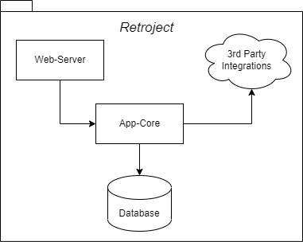

# Übersicht über die Softwarearchitektur

Die Datengrundlage der _Retrojet_ Applikation ist eine Datenbank auf die der Kern der Anwendung (`App-Core`) zugreift. Der Web-Server als Zugang für die verschiedenen Clients bedient sich bei diesem. Gleichzeitig ist innerhalb des `App-Core` die Integration der Schnittstellen verschiedenen Drittanbieter umgesetzt.

